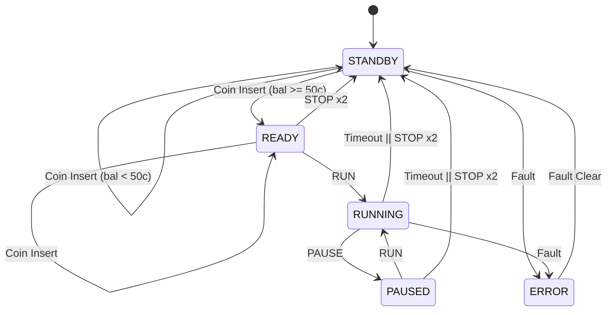
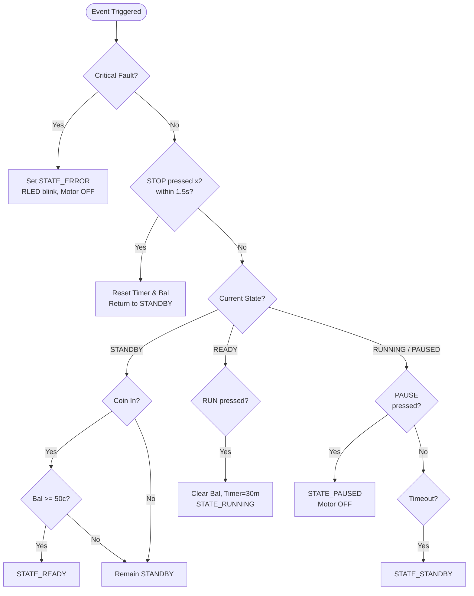

# Washing Machine FSM Diagrams

## State Transition Diagram

```mermaid
stateDiagram
    [*] --> STANDBY

    STANDBY --> STANDBY : Coin Insert (bal < 50c)
    STANDBY --> READY : Coin Insert (bal >= 50c)
    STANDBY --> ERROR : Fault

    READY --> READY : Coin Insert
    READY --> RUNNING : RUN
    READY --> STANDBY : STOP x2

    RUNNING --> PAUSED : PAUSE
    RUNNING --> STANDBY : Timeout || STOP x2
    RUNNING --> ERROR : Fault

    PAUSED --> RUNNING : RUN
    PAUSED --> STANDBY : Timeout || STOP x2

    ERROR --> STANDBY : Fault Clear
```

## Flowchart

```mermaid
flowchart TD
    start([Event Triggered]) --> fault{Critical Fault?}
    
    fault -- Yes --> seterr[Set STATE_ERROR<br>RLED blink, Motor OFF]
    fault -- No --> stopcheck{STOP pressed x2<br>within 1.5s?}
    
    stopcheck -- Yes --> reset[Reset Timer & Bal<br>Return to STANDBY]
    stopcheck -- No --> statecheck{Current State?}
    
    %% Branch STANDBY
    statecheck -- STANDBY --> coinin{Coin In?}
    coinin -- Yes --> balcheck{Bal >= 50c?}
    coinin -- No --> loopst[Remain STANDBY]
    balcheck -- Yes --> setready[STATE_READY]
    balcheck -- No --> loopst
    
    %% Branch READY
    statecheck -- READY --> runpressed{RUN pressed?}
    runpressed -- Yes --> startrun[Clear Bal, Timer=30m<br>STATE_RUNNING]
    
    %% Branch RUNNING/PAUSED
    statecheck -- RUNNING / PAUSED --> pausepressed{PAUSE<br>pressed?}
    pausepressed -- Yes --> setpause[STATE_PAUSED<br>Motor OFF]
    pausepressed -- No --> timeout{Timeout?}
    timeout -- Yes --> setstandby[STATE_STANDBY]
```
